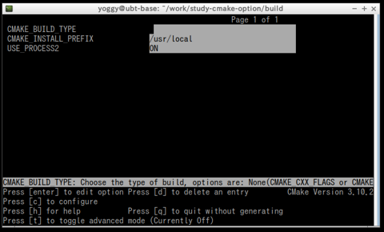

# study-cmake-option
## how to

    $ git clone https://github.com/yoggy/study-cmake-option.git
    $ cd study-cmake-option
    $ ls
    CMakeLists.txt  LICENSE.txt  README.md  main.c  process1.c  process2.c
    
    $ mkdir build
    $ cd build
    
    // build with_USE_PROCESS2=NO
    $ cmake .. && make && ./a.out
       .
       .
    [100%] Built target a.out
    call method: /home/yoggy/work/study-cmake-option/process1.c:6:process(2, 3)
    process(2, 3) -> 5

    // build USE_PROCESS2=YES
    $ cmake -DUSE_PROCESS2=YES .. && make && ./a.out
           .
           .
    call method: /home/yoggy/work/study-cmake-option/process2.c:6:process(2, 3)
    process(2, 3) -> 6

## source code

```cmake:CMakeLists.txt
cmake_minimum_required(VERSION 3.1)
project(study-cmake-option)

option(USE_PROCESS2 "use process2.c" OFF)

set(SRC main.c)

if(USE_PROCESS2)
  set(SRC ${SRC} process2.c)
else()
  set(SRC ${SRC} process1.c)
endif()

add_executable(a.out ${SRC})

message(STATUS "USE_PROCESS2=${USE_PROCESS2}")
message(STATUS "SRC=${SRC}")
```

```c:main.c
#include <stdlib.h>
#include <stdio.h>

extern int process(int a, int b);

int main(int argc, char *argv[])
{
  int a = 2;
  int b = 3;

  int c = process(a, b);
  printf("process(%d, %d) -> %d\n", a, b, c);

  return 0;
}
```

```c:process1.c
#include <stdlib.h>
#include <stdio.h>

int process(int a, int b)
{
  printf("call method: %s:%d:process(%d, %d)\n", __FILE__, __LINE__, a, b);
  return a + b;
}
```

```c:process2.c
#include <stdlib.h>
#include <stdio.h>

int process(int a, int b)
{
  printf("call method: %s:%d:process(%d, %d)\n", __FILE__, __LINE__, a, b);
  return a * b;
}
```

## ccmake

    $ sudo apt install cmake-curses-gui
    $ cd ~/work/study-cmake-option/build/
    $ ccmake ..



## Copyright and license
Copyright (c) 2019 yoggy

Released under the [MIT license](LICENSE.txt)

